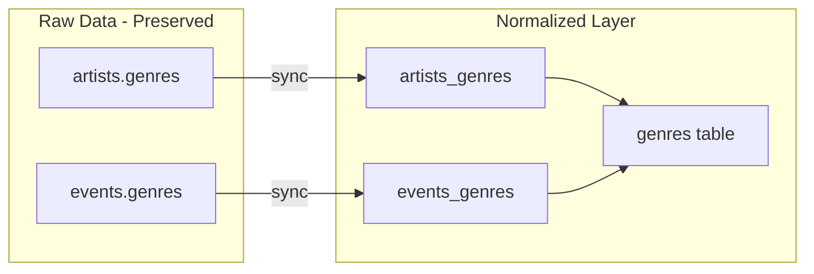

# Genre Normalization Plan (3NF Architecture)

Normalized genre system using a proper 3NF structure: a `genres` table with normalized keys for deduplication, linked to artists and events via join tables.

---

## Architecture



**Data flow:**
- Raw JamBase strings stay in `artists.genres` and `events.genres` (no changes)
- New `genres` table stores unique normalized genres
- Join tables link entities to normalized genres
- Daily sync creates normalized entries automatically
- One-time backfill processes existing data

---

## Database Schema

**Table: `genres`**
| Column | Type | Description |
|--------|------|-------------|
| `id` | UUID | Primary key |
| `name` | TEXT | Display name (e.g., "Hip Hop") |
| `normalized_key` | TEXT | Dedup key (e.g., "hip hop"), UNIQUE |
| `slug` | TEXT | URL-safe (e.g., "hip-hop"), UNIQUE |
| `created_at` | TIMESTAMPTZ | Creation timestamp |

**Table: `artists_genres`**
| Column | Type | Description |
|--------|------|-------------|
| `artist_id` | UUID | FK to artists(id), ON DELETE CASCADE |
| `genre_id` | UUID | FK to genres(id), ON DELETE CASCADE |
| `created_at` | TIMESTAMPTZ | Creation timestamp |
| PRIMARY KEY | (artist_id, genre_id) | |

**Table: `events_genres`**
| Column | Type | Description |
|--------|------|-------------|
| `event_id` | UUID | FK to events(id), ON DELETE CASCADE |
| `genre_id` | UUID | FK to genres(id), ON DELETE CASCADE |
| `created_at` | TIMESTAMPTZ | Creation timestamp |
| PRIMARY KEY | (event_id, genre_id) | |

**Function: `normalize_genre_key(raw TEXT)`**
- Converts raw genre string to normalized key
- Trims, lowercases, collapses hyphens/underscores/spaces to single space

**Function: `upsert_genre(raw_genre TEXT)`**
- Normalizes input, upserts into genres table, returns genre ID

**Function: `sync_artist_genres(p_artist_id UUID, p_raw_genres TEXT[])`**
- Clears existing artist genre links
- Creates new links based on raw genres array

**Function: `sync_event_genres(p_event_id UUID, p_raw_genres TEXT[])`**
- Same pattern for events

---

## Files

| File | Purpose |
|------|---------|
| `sql/genres_schema.sql` | Tables, indexes, functions, RLS policies |
| `sql/backfill_normalized_genres.sql` | One-time backfill from existing data |
| `scripts/sync-jambase-incremental-3nf.mjs` | Daily sync (modified to normalize genres) |
| `src/types/database.ts` | TypeScript interfaces (Genre, ArtistGenre, EventGenre) |

---

## Setup Steps

### 1. Create Schema
Run `sql/genres_schema.sql` in Supabase to create:
- Tables: `genres`, `artists_genres`, `events_genres`
- Functions: `normalize_genre_key`, `upsert_genre`, `sync_artist_genres`, `sync_event_genres`
- Indexes and RLS policies

### 2. Backfill Existing Data
Run `sql/backfill_normalized_genres.sql` to:
- Extract all unique genres from `artists.genres` and `events.genres`
- Populate the `genres` table
- Create links in `artists_genres` and `events_genres`

### 3. Daily Sync (Automatic)
The modified `sync-jambase-incremental-3nf.mjs` automatically:
- Calls `sync_artist_genres()` after each artist insert/update
- Calls `sync_event_genres()` after each event insert/update
- Reports genre normalization stats in sync output

---

## Querying

**Get normalized genres for an artist:**
```sql
SELECT g.name, g.slug
FROM genres g
JOIN artists_genres ag ON ag.genre_id = g.id
WHERE ag.artist_id = :artist_id;
```

**Find artists by genre:**
```sql
SELECT a.*
FROM artists a
JOIN artists_genres ag ON ag.artist_id = a.id
JOIN genres g ON g.id = ag.genre_id
WHERE g.normalized_key = 'hip hop';
```

**Find events by genre:**
```sql
SELECT e.*
FROM events e
JOIN events_genres eg ON eg.event_id = e.id
JOIN genres g ON g.id = eg.genre_id
WHERE g.slug = 'electronic';
```

**Raw JamBase strings still available:**
```sql
SELECT genres FROM artists WHERE id = :artist_id;  -- Original array
```

---

## Notes

- **Raw data preserved:** `artists.genres` and `events.genres` columns are not modified
- **Automatic deduplication:** Normalization key ensures "Hip-Hop", "hip hop", "hiphop" all map to same genre
- **Scalable:** Join tables support efficient many-to-many queries with proper indexes
- **RLS enabled:** All new tables have row-level security with public read access
